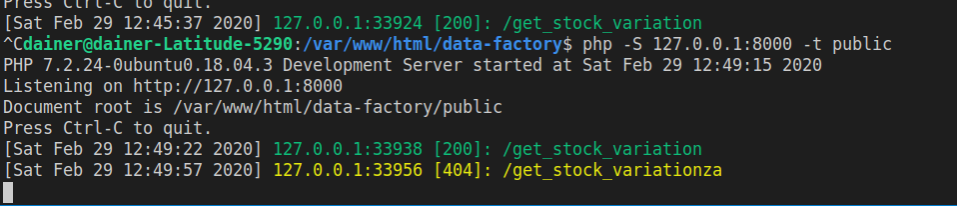

# ORANGE DATA FACTORY - PHP REST API


## Installation and Running

Before starting with the project make sure you have the following dependencies: 

- **php 7.2 or newer** is installed.
- composer
- mysql

1. Run composer update/install 

In order to install the dependencies of this project and generate the vendor folder run the following: 

```markdown
$ cd /path_to_project/
$ composer update
$ composer install
```

2. Create the environment file and logs directory: 

First create the two files running on your bash: 

```markdown
cd /path_to_project/
touch .env
touch logs.log
```

Then adjust the permission to let the webuser have full access to them.

```markdown
cd /path_to_project/
chown www-data .env
chown www-data logs.log
chmod 570 .env
chmod 570 logs.log
```

3. Create Database and generate the configuration: 

To create the database schema and fill it, import to mysql the [seed.sql](seed.sql) file.

Then proceed by running the database configuration script. 

```markdown
php DbConfig.php // This script supports flags, run with --help to see usage.
```

**Optional:**

If you would like to fill the database from a different seed, you can run DbFiller:

```markdown
php DbFiller.php -c path_to_csv_file.csv // path_to_csv_file.csv serves as seed for newly created database.
```

4. Run the API

To start the api on localhost listening on port 8000, run:

```markdown
php -S 127.0.0.1:8000 -t public
```


